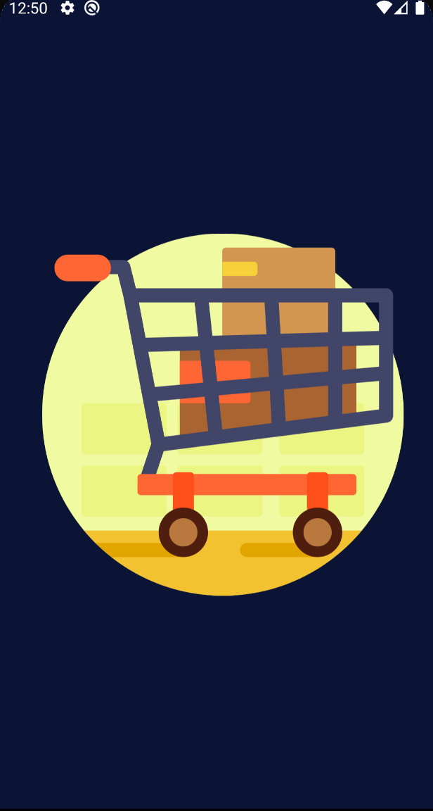
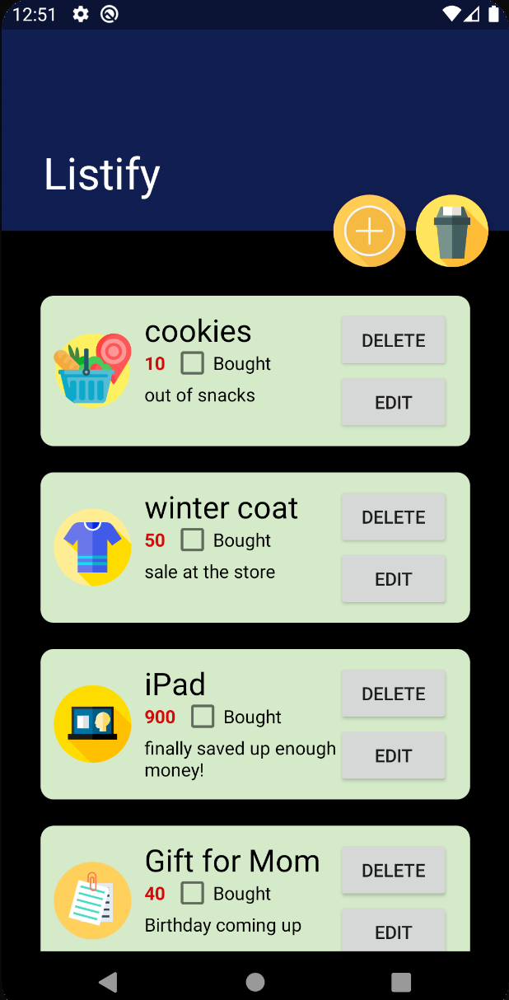
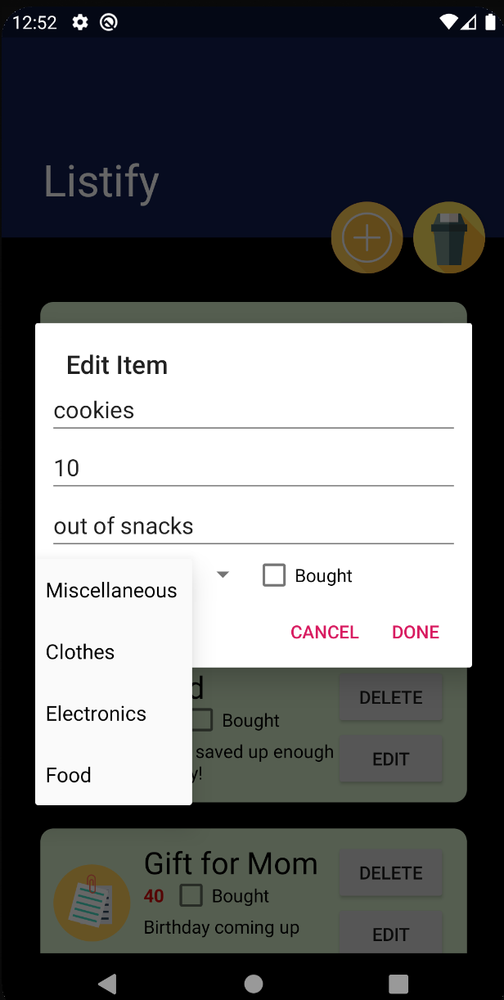

# Listify - A Shopping List Android Application
Shopping List Project in Android (Kotlin) 

This is a simple shopping list app I developed for the Mobile Development course taught by Péter Ekler at AIT-Budapest. The android app allows users to list items to their shopping list, stores the user entries to a RoomDatabase, and allows editing, reordering, and deleting of items from the list. 

## Features

Listify provides the user with the ability to store their shopping list on their mobile device. The shopping list items can be added to the list using the floating + button; Users then enter information about the item they need to buy:
  - Name
  - Description 
  - Price
  - Category 
  - Bought (checkbox indicating whether the item has been bought yet or not by the user)

The items appear on the main shopping list page with relevant information as well as an icon indicating the category of the item as selected by the user. Items can be edited by clicking on the edit button in the item's specific dialog - prompting another dialog fragment to make changes to the item info. Items can also be deleted individually by button or swiping left or right. Items can be ordered by dragging the item dialog up and down. The user also has the ability to delete all the items from the list by clicking the floating trash can button next to the + button. All the added, edited, and deleted items are persistently stored in a RoomDatabase. 


<p align="center">
  
  
  
</p>

## Repository structure 
```
├── README.md                                 : ReadMe description of the project
│
└── ShoppingList/app                          : Project files
    ├── src/main                    
    │   ├── java/.../shoppinglist       
    │   │   ├── adapter                       : Adapter implementation to use RecyclerView for the scrolling list
    │   │   ├── touch                         : Touch helper callback component classes that allow drag and drop reordering of shopping list items and swipe to delete
    │   │   │   ├── ListRecyclerTouchCallback                  
    │   │   │   └── ListTouchHelperCallback 
    │   │   │
    │   │   ├── data                          : Database components for persistent storage using RoomDatabase
    │   │   │   ├── AppDatabase.kt            : Database Initializer
    │   │   │   ├── ShoppingItem.kt           : Shopping Item entity class (table: shoppingList)
    │   │   │   └── ShoppingListDAO.kt        : Data Access Object class that allows querying the database
    │   │   │
    │   │   ├── ItemDialog.kt                 : Dialog fragment for adding and editing items
    │   │   ├── ScrollingActivity.kt          : Main scrolling view display of the shopping list
    │   │   └── SplashScreenActivity.kt       : Splash screen activity 
    │   │
    │   ├── res                               : companion resource files for the project
    │   │   ├── anim                          : animation xml file for the splash screen
    │   │   ├── drawable                      : xml files for category icons, add item button, and launcher icon
    │   │   ├── layout                        : xml layout files for activities: shopping list, splash screen, dialog, & item row
    │   │   ├── mipmap-...                    : launcher icon versions for different screen densities
    │   │   └── values                        : xml files for extracted strings and customized styles
    │   │
    │   └── AndroidManifest.xml               : manifest file for the application
    │
    └── build.gradle                          : gradle file for the app module
      

```

# Future Improvements 

The layout design is hardcoded is certain activities. I hope to make the layout components relative to android versions after learning a bit more about converting design to xml layout files effectively.  

### Contributors

Nukhbah Majid

(inspiration from Péter Ekler's demo project - To Do List)
